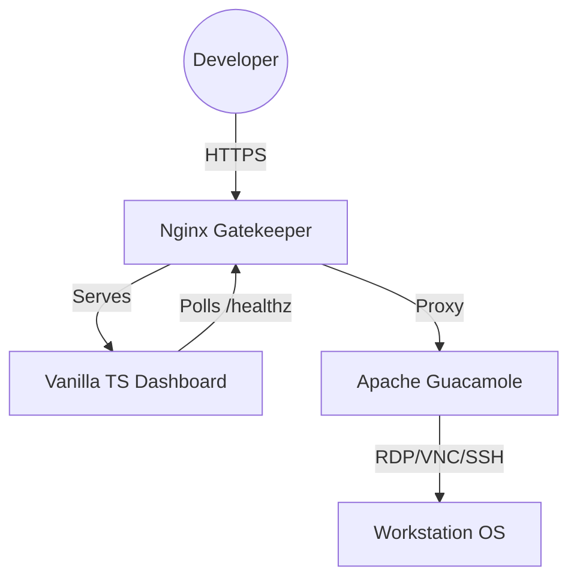

<!--
Copyright 2026 Google LLC

Licensed under the Apache License, Version 2.0 (the "License");
you may not use this file except in compliance with the License.
You may obtain a copy of the License at

    https://www.apache.org/licenses/LICENSE-2.0

Unless required by applicable law or agreed to in writing, software
distributed under the License is distributed on an "AS IS" BASIS,
WITHOUT WARRANTIES OR CONDITIONS OF ANY KIND, either express or implied.
See the License for the specific language governing permissions and
limitations under the License.
-->

# Design Document: Preflight Orchestration Layer

## 1. Context & Objectives

The Preflight layer is a specialized orchestration and UI component designed to eliminate the "Hard Silence" during Google Cloud Workstation startup. It acts as an intelligent proxy that serves a local loading interface while simultaneously validating backend readiness and managing secure protocol handoff.

### Goals

- Provide sub-1500ms visual feedback.
- Automate Guacamole/Nginx credential synchronization.
- Decouple the startup UI from the graphical backend (GNOME, etc.).

## 2. System Architecture

The system follows a tiered interceptor pattern:



### 2.1. Traffic Interception

Upon container boot, an `nftables` script redirects initial port 80/443 traffic to the Nginx process. Nginx is configured to serve the SPA assets from `/var/www/html` until the backend satisfies the readiness probe.

### 2.2. Ephemeral Security Model

To maintain zero-trust principles within the container:

1. **Password Generation**: `/assets/google/scripts/config_rendering.sh` generates a random 32-character string.
2. **Synchronized Injection**: This password is injected into:
   - `user-mapping.xml` (Guacamole's auth database).
   - Nginx headers (for automated proxy authentication).
3. **Internal Auth**: Nginx injects the `Authorization` header on all proxied requests, making the security handshake transparent to the SPA.

## 3. Component Design

### 3.1. Frontend State Machine (SPA)

The UI is a stateful Single Page Application managed via a centralized singleton `AppState`:

- **Atomic State**: All configuration (timeout, interval, lang) lives in a single object.
- **uiTransient**: A staging object that snapshots unsaved modal changes, allowing for lossless navigation and explicit rollbacks on "Cancel".
- **Functional Reset**: Saving settings clears the active timer and re-triggers the `health_module` entry point, enabling rapid iterative testing.

### 3.2. Phased Health Monitoring

The polling logic implements a dual-phase state machine:

- **Phase 1: Nominal**: High-frequency polling (default 1s) until the `timeout` threshold is reached.
- **Phase 2: Backoff**: Transition to exponential backoff (multiplier 1.5, capped at 30s) to reduce resource contention during delayed boots.

### 3.3. "Cinematic" UX Principles

To reduce perceived wait time, the UI employs specific visual cues:

- **Starfield Drift**: A low-CPU CSS animation providing a sense of active life.
- **Pulsing State**: The "STARTING" text uses a 2000ms pulse cycle to indicate background processing.
- **Inclusive Design**: Focus rings utilize high-contrast borders, and dynamic status updates are piped to `aria-live` regions.

## 4. Build & Deployment Pipeline

### 4.1. Multi-Stage Docker Build

- **Builder Stage**: Node.js environment conditionally compiles TypeScript via Vite and generates SRI hashes. If the `PREFLIGHT_WEB_REPO` ARG is provided, it clones the source and builds the SPA from `PREFLIGHT_WEB_DIR`. If `PREFLIGHT_WEB_REPO` is empty, the stage is skipped.
- **Final Stage**: Alpine-based image containing Nginx and Guacamole (Tomcat). Nginx routing is dynamically configured at runtime (`config_rendering.sh`) based on whether the SPA assets are present.

### 4.2. Document Rendering Pipeline

A specialized Node script (`generate_fragments.js`) converts Markdown docs (e.g., Privacy Notice) into stylized HTML fragments during the build phase. These fragments are bundled into the SPA, ensuring that critical documentation is available offline and network-independent.

## 5. Operational Design & Lifecycle

### 5.1. Local Development Environment

The Preflight UI is a Vanilla TypeScript application powered by Vite. To set up a local development environment:

1.  **Dependencies**: Run `npm install` within the `web/` directory.
2.  **Dev Server**: Execute `npm run dev` to start the Vite development server with hot-module replacement.
3.  **Validation**: Execute `npm test` to run the Vitest suite.

### 5.2. Build Pipeline Details

The build process is automated within the Docker lifecycle but can be executed manually for validation:

1.  **Fragment Generation**: `node scripts/build/generate_fragments.js` converts internal Markdown docs into HTML.
2.  **Vite Compilation**: `vite build` bundles the TypeScript and CSS assets.
3.  **SRI Injection**: `node inject-sri.cjs` generates Subresource Integrity hashes for all build artifacts.

### 5.3. Deployment & Hot-patching

To test changes on a live Cloud Workstation without a full image rebuild, use the localized skill script:

```bash
./examples/preflight/skills/update-preflight/scripts/hotpatch_frontend.sh --wipe
```

### 5.4. Maintenance Procedures

- **Adding Locales**: Create a new JSON file in `web/public/locales/` and register the language code in the `SUPPORTED_LANGS` constant within `web/i18n_module.ts`.
- **Adjusting Health Probes**: Modify the `BACKOFF_MULTIPLIER` and `MAX_BACKOFF_INTERVAL_MS` constants in `web/health_module.ts` to tune the polling behavior.

## 6. Testing & Validation

### 5.1. Unit Testing (Vitest)

- **JSDOM Abstraction**: Since `window.location` is immutable in JSDOM, all navigation logic is wrapped in `window_utils.ts` and mocked during tests.
- **Event Simulation**: Tests dispatch synthesized `KeyboardEvent` on `document.body` to verify shortcut aliases (e.g., `?` for Help) while maintaining JSDOM stability.

### 5.2. Integration Hooks

The layer provides a `/healthz` endpoint which Nginx maps to Guacamole's internal token API. A successful `200 OK` or a handled `404/405` from Tomcat serves as the definitive readiness signal.
