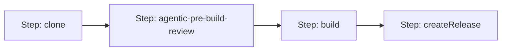

<!--
Copyright 2026 Google LLC

Licensed under the Apache License, Version 2.0 (the "License");
you may not use this file except in compliance with the License.
You may obtain a copy of the License at

    https://www.apache.org/licenses/LICENSE-2.0

Unless required by applicable law or agreed to in writing, software
distributed under the License is distributed on an "AS IS" BASIS,
WITHOUT WARRANTIES OR CONDITIONS OF ANY KIND, either express or implied.
See the License for the specific language governing permissions and
limitations under the License.
-->

# Architecture & Design: AI Agentic SDLC & Skill Registry

This document outlines the architectural patterns, step sequencing, and orchestration logic implemented to enable automated AI developer loops inside the CI/CD pipelines.

---

## 1. Lifecycle Phase Configuration Model

To enable automated engineering loops (such as codebase reviews or security audits), the pipeline mounts a Python-based ADK Agent runner and connects it to the project's **GCP Skill Registry**.

We structure agent tasks inside the application map under phase-specific namespaces. This keeps configuration modular and makes it easy to add new hooks in the future:

```hcl
agents = {
  "pre-build" = {
    "review" = {
      enabled       = true
      model         = "gemini-3.5-pro" # [Optional] Override model
      personas      = ["swe", "security", "sre"] # Sequential personas
      instructions  = "You are a senior engineer..." # [Optional] Custom system instructions
      prompt        = "Review the codebase diff..." # [Optional] Custom prompt
      allow_failure = true # If true, agent warnings will not block the build compilation
    }
  }
}
```

---

## 2. Step Sequencing

When a `pre-build` agent is enabled, the pipeline dynamically adjusts step dependencies (`wait_for`) so that the build step runs **after** the agent completes its review:

- **Review Step (`agentic-pre-build-review`)**: Waits for `clone` to finish.
- **Build Step (`build`)**: Automatically changes its dependency to wait for `agentic-pre-build-review` instead of `clone`.



---

## 3. Parallel Orchestrated Execution Flow

To minimize execution time and deliver consolidated summaries, the `build-runner` image executes a **Coordinator-Delegate Parallel Orchestrator** wrapper (`scripts/agentic_runner.py`) using the **Agent Development Kit (ADK)**:

1.  **Concurrent Execution**: The script spawns each requested persona review agent (e.g. `reviewer_swe`, `reviewer_security`) in parallel tasks using Python's `asyncio.gather`.
2.  **Dynamic Skill Resolution**: Each task connects to the project's `GCPSkillRegistry` to load and cache its specific persona guidelines.
3.  **Synthesis and Consolidation**: Once all concurrent reviews complete, the runner passes the individual logs to a central **Orchestrator Agent**. The orchestrator synthesizes the specialize findings into a single executive Markdown report, highlighting blocking security vulnerabilities at the top, followed by SWE quality improvements.

---

## 4. Developer Script Extensibility (Workspace Agents)

To allow developers to customize or entirely replace the default review orchestration flow:

- **Discovery**: The runner checks the application's sub-directory for a custom script: `${SKAFFOLD_PATH}/.agentic/review.py`.
- **Execution**: If found, it runs this script directly using `/usr/bin/python3`, passing all Cloud Build environment configurations. It then exits early using the custom script's exit status.
- **Fallback**: If no custom script is present, the runner proceeds with the default parallel multi-persona review orchestrator.

---

## 5. Automated IAM Governance

To prevent manual IAM management overhead, the module automatically checks if any application has configured active agents:

```tf
needs_agent_platform_access = anytrue([
  for app_name, app_config in var.apps : try(app_config.agents["pre-build"]["review"].enabled, false)
])
```

If `needs_agent_platform_access` is `true`, the module automatically appends `roles/aiplatform.user` to the Cloud Build service account roles. This ensures the builder has Agent Platform access only when actively required for agentic SDLC tasks.
