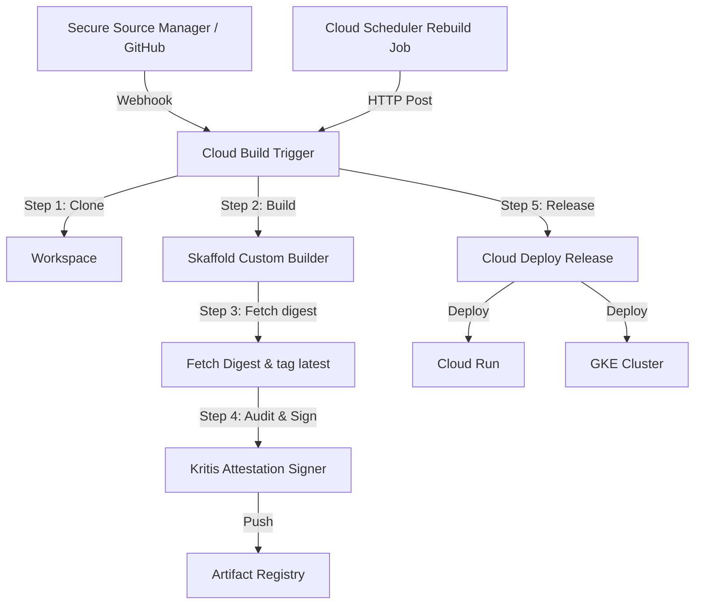

<!--
Copyright 2026 Google LLC

Licensed under the Apache License, Version 2.0 (the "License");
you may not use this file except in compliance with the License.
You may obtain a copy of the License at

    https://www.apache.org/licenses/LICENSE-2.0

Unless required by applicable law or agreed to in writing, software
distributed under the License is distributed on an "AS IS" BASIS,
WITHOUT WARRANTIES OR CONDITIONS OF ANY KIND, either express or implied.
See the License for the specific language governing permissions and
limitations under the License.
-->

# Architecture & Design: IaC & CI/CD Pipeline Automation

This document outlines the design decisions, component architecture, and resource-mapping logic implemented in the `cicd-foundation` IaC modules.

---

## 1. System Architecture

The automation foundation organizes GCP services into a unified delivery loop:



---

## 2. Dynamic Runtime Resolution

The core design centers around an optional `runtime` parameter configured per application.

### 2.1 Deployment Runtimes (`"cloudrun"`, `"gke"`)

- **CD Resources**: Standard delivery pipelines (`google_clouddeploy_delivery_pipeline`) and target resources are provisioned.
- **Releases**: The build trigger compiles the image and appends a `createRelease` step to launch the Cloud Deploy pipeline.

### 2.2 Workstation Runtimes (`"workstations"`)

- **Target**: The image is mapped to a Cloud Workstation configuration rather than a runtime target.
- **Scheduler**: Rebuilds are unpaused by default (`paused = false`) to pull upstream dependencies regularly.

### 2.3 Build-Only / DevContainers (`null` Runtime)

- **CI-Only**: Setting `runtime` to `null` disables all CD pipeline operations. The trigger executes only building, tagging, and vulnerability signing.
- **Scheduler**: A Scheduler job is created to enable on-demand or manually unpaused scheduled rebuilds, but is **paused by default (`paused = true`)**.

---

## 3. Cloud Build Script Outsourcing

To prevent Cloud Build substitution conflicts and simplify quoting, complex bash steps are externalized to the `scripts/` folder:

- **The Escape Problem**: Inline heredoc strings in Terraform triggers require quadruple escaping (e.g. `$$$${IMAGE_NAME}`) to prevent Cloud Build from mistaking them for build substitutions (which are restricted to `${_VAR}` syntax).
- **The Sourcing Fix**: Moving scripts to `.sh` files loaded via `file("${path.module}/scripts/<name>.sh")` ensures scripts are clean, standard bash.
- **URL Safety**: Terraform modules loaded over HTTPS/SSH local-cache the directories, allowing `${path.module}` to resolve paths correctly at run-time.

---

## 4. Rebuild Automation (Scheduler)

Cloud Scheduler rebuild triggers are implemented with the following conditional pausing logic:

```tf
paused = coalesce(
  try(each.value.workstation_config.paused, null),
  try(each.value.runtime, null) == "workstations" ? false : true
)
```

This logic guarantees that unless explicitly overridden by the user under `workstation_config.paused`:

- Only **`workstations`** automatically rebuild.
- Application microservices and devcontainer templates remain idle to prevent unnecessary compute costs.
